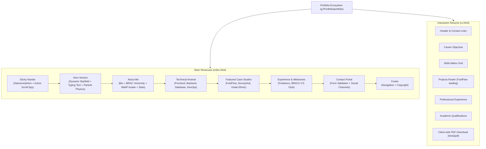
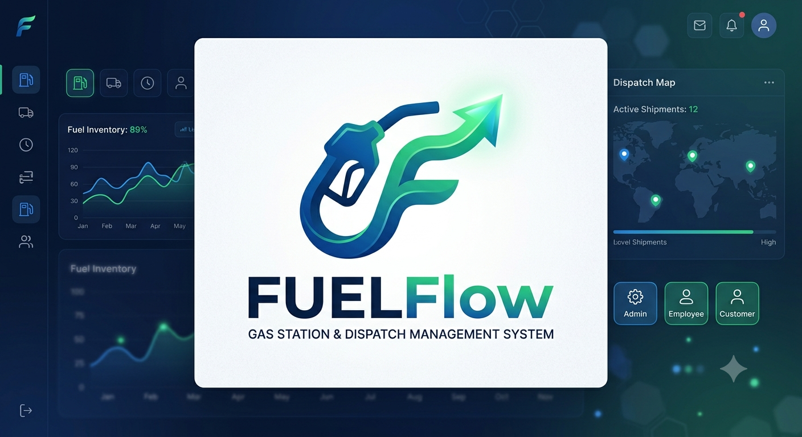

# 🌌 Portfolio — Developer Knowledge Base & System Architecture
## **Ashraful Haque Akash — Full Stack Web Developer & Software Engineer**

| Field | Value |
|---|---|
| **Project Name** | Ashraful Haque Akash Portfolio & Interactive CV |
| **Owner / Developer** | Ashraful Haque Akash |
| **Institution** | BRAC University, Dhaka, Bangladesh (B.Sc. in Computer Science & Engineering) |
| **Live Production** | [ashrafulhaque.com](https://ashrafulhaque.com) / [GitHub Pages](https://ashrafulhaqueakashw-create.github.io/My_Portfolio) |
| **GitHub Repository** | [`ashrafulhaqueakashw-create/My_Portfolio`](https://github.com/ashrafulhaqueakashw-create) |
| **Document Version** | 1.0.0 |
| **Last Updated** | September 23, 2026 |
| **Primary Location** | `g:\Portfolio\portfolio` |

---

## 🌟 1. Executive Summary & Purpose

This document provides a **0-to-100% comprehensive technical blueprint and knowledge base** for Ashraful Haque Akash's developer portfolio ecosystem. It is designed to allow any developer, reviewer, recruiter, or AI agent to immediately understand the entire codebase, architecture, visual design system, interaction engine, asset pipeline, and deployment strategy without needing prior walkthroughs.

### Core Objectives
1. **Showcase Full-Stack Engineering Rigor**: Present production-grade projects demonstrating real-world problem solving (e.g. FuelFlow's congestion dispatch algorithms, SurveyHub's dynamic form builder, Utsab Ethnic's high-trust e-commerce).
2. **Zero-Framework High Performance**: Deliver smooth 60fps animations, glassmorphism, dynamic starfields, and particle physics using pure HTML5, CSS3, Tailwind CSS, and Vanilla JavaScript with near-zero bundle overhead.
3. **Dual-Role Presentation**:
   - **Interactive Showcase (`index.html`)**: Rich visual case studies, skill visualizations, and contact funnels.
   - **Print-Optimized CV & Resume (`cv.html`)**: Dual-mode curriculum vitae featuring pixel-perfect responsive mobile reading and standard A4 single/multi-page print formatting with automated PDF export.

---

## 🏗️ 2. Architectural Blueprint & Directory Map

```text
g:\Portfolio\
├── Ashraful_Haque_Akash_CV.docx   # Master editable word resume
├── Ashraful_Haque_Akash_CV.pdf    # Pre-compiled high-res PDF CV
├── PORTFOLIO_CONTEXT.md           # Root workspace mirror of this documentation
└── portfolio/                     # Web project root
    ├── index.html                 # Main single-page application & project showcase
    ├── cv.html                    # Interactive, print-optimized resume
    ├── styles.css                 # 1000+ line custom CSS engine & animations
    ├── script.js                  # 700+ line interaction & particle engine
    ├── tailwind.min.css           # Local fallback utility CSS
    ├── README.md                  # Quick-start and repository guide
    ├── PORTFOLIO_CONTEXT.md       # Zero-to-100% Knowledge Base (this file)
    │
    ├── [Images & Assets]
    │   ├── IMG_2637.jpg           # High-resolution profile avatar
    │   ├── IMG_2637.webp          # Next-gen WebP compressed avatar
    │   ├── Fuel_Flow.png          # High-resolution FuelFlow case study preview
    │   ├── Fuel_Flow.webp         # Next-gen WebP FuelFlow screenshot
    │   ├── SurveyHub.png          # High-resolution SurveyHub case study preview
    │   ├── SurveyHub.webp         # Next-gen WebP SurveyHub screenshot
    │   ├── Utsab_Ethnic.jpg       # High-resolution Utsab Ethnic preview
    │   └── Utsab_Ethnic.webp      # Next-gen WebP Utsab Ethnic screenshot
    │
    └── cv.pdf                     # Direct download target for CV export
```

---

## 🧭 3. Page Structure & Component Breakdown



### 3.1 `index.html` — Section Details

1. **Sticky Glass Navigation**:
   - Fixed header with frosted glass backdrop blur (`backdrop-blur-md bg-slate-900/80 border-b border-white/10`).
   - Active scroll-spy observer highlighting the current section in neon cyan (`text-cyan-400`).
   - Accessible hamburger menu drawer with smooth toggle transitions for mobile viewports.
2. **Hero Section (`#home`)**:
   - High-impact animated headline with gradient text (`bg-clip-text text-transparent bg-gradient-to-r from-cyan-400 via-blue-500 to-purple-600`).
   - Typewriter effect subtitle cycling developer focus areas.
   - Multi-layered cosmic canvas containing algorithmic starfields and floating zero-gravity particles.
   - Dual CTAs: "Explore Projects" (smooth anchor jump) and "Download CV" (modal or direct download).
3. **About Me Section (`#about`)**:
   - Professional bio highlighting computer science foundations at BRAC University and production web experience.
   - Next-gen `<picture>` element with WebP asset and PNG/JPG fallback for optimal bandwidth.
   - Metric callout cards: Projects Completed, Technologies Mastered, Clean Code Commitment.
4. **Technical Arsenal Section (`#skills`)**:
   - Categorized into 4 distinct pillars:
     - **Frontend Engineering**: React.js, Next.js 15, TypeScript, Vue.js, Tailwind CSS, HTML5/CSS3.
     - **Backend Engineering**: Node.js, Express.js, Python, Java, C++, RESTful API Architecture.
     - **Database & Data Modeling**: PostgreSQL, MySQL, MongoDB, Relational Schema Normalization.
     - **DevOps & Architecture**: Git/GitHub, Docker, CI/CD Pipelines, Agile/Scrum, WebSockets, JWT Auth.
5. **Featured Projects Section (`#projects`)**:
   - Comprehensive case study cards with live screenshots, technology pills, engineering achievements, and direct links to live demos and GitHub repositories.
6. **Experience & Activities Section (`#experience`)**:
   - Freelance Web Developer (2024–Present): Client solutions, API integrations (Claude/OpenAI), responsive architectures.
   - BRAC University Computer Science Club: Hackathons, competitive programming, collaborative sprints.
7. **Contact Section (`#contact`)**:
   - Direct communication channels: Email (`ashraful.haque.akash.w@gmail.com`), GitHub, LinkedIn.
   - Interactive contact form with client-side feedback and validation.

---

## 🚀 4. Deep Dive: Featured Engineering Projects

### 4.1 Case Study 01: FuelFlow — Gas Station & Smart Dispatch Logistics
* **Role**: Lead Full-Stack Architect
* **Tech Stack**: Next.js 15.5 (Turbopack), React 19, TypeScript 5, Tailwind CSS 4, MySQL (XAMPP), JWT, bcrypt
* **Repository**: [`ashrafulhaqueakashw-create/Fuel_Flow`](https://github.com/ashrafulhaqueakashw-create/Fuel_Flow)
* **Key Achievements**:
  * **Smart Congestion-Aware Dispatching**: Built a 2-hour scheduling engine that analyzes station tank volumes and urban traffic, granting automatic 10%–15% off-peak delivery discounts.
  * **Role-Based Architecture**: Unified portals for Station Admin (KPIs, stock replenishment), Staff (shift check-in/out, order delivery fulfillment), and Customer Self-Service.
  * **100% WCAG 2.1 Level AA Accessibility**: Re-engineered UI from AI-neon gradients to an authentic, high-trust human light theme, passing Lighthouse audits with zero contrast failures ($\ge 4.5:1$ ratio).
  * **Relational Database Engine**: 8-table relational schema handling live inventory auto-deduction, low-stock alerts (<10L), and BSTI-calibrated meter receipts.

### 4.2 Case Study 02: SurveyHub — Full-Stack Survey & Analytics Platform
* **Role**: Full-Stack Developer
* **Tech Stack**: React.js, Node.js, Express.js, MongoDB, JWT, Vite
* **Repository**: [`ashrafulhaqueakashw-create/SurveyHub`](https://github.com/ashrafulhaqueakashw-create/SurveyHub)
* **Key Achievements**:
  * Dynamic survey creation engine allowing custom multi-type questionnaires (multiple choice, rating, text).
  * Real-time response analytics dashboard calculating percentage distributions and submission timestamps.
  * Secure JWT authentication with user authorization for managing active and archived surveys.

### 4.3 Case Study 03: Utsab Ethnic — E-Commerce Fashion Platform
* **Role**: Frontend & UI Engineer
* **Tech Stack**: React.js, Tailwind CSS, Stripe API, Node.js
* **Repository**: [`ashrafulhaqueakashw-create/Utsab_Ethnic`](https://github.com/ashrafulhaqueakashw-create/Utsab_Ethnic)
* **Key Achievements**:
  * High-trust, culturally authentic e-commerce storefront with high-resolution product catalogs.
  * Interactive shopping bag, instant client-side subtotal & shipping calculation, and secure Stripe checkout flow.
  * Zero-layout-shift responsive grid layout across mobile and desktop.

---

## 🎨 5. Visual Design System & Animation Engine

### 5.1 Color Tokens & Theming
The portfolio utilizes a dark celestial aesthetic with deep glassmorphism and cyan/blue accents:

| Token Name | Hex / RGBA | Usage |
|---|---|---|
| **Background Base** | `#0b0f19` / `#0f172a` | Deep space backdrop |
| **Glass Surface** | `rgba(255, 255, 255, 0.05)` | Frosted cards & containers |
| **Glass Border** | `rgba(255, 255, 255, 0.12)` | Subtle card elevation |
| **Cyan Glow Accent** | `#06b6d4` (`rgb(6, 182, 212)`) | Primary interactive buttons, icons, links |
| **Deep Blue Accent** | `#3b82f6` (`rgb(59, 130, 246)`) | Gradients, badges, active hover states |
| **Text Primary** | `#ffffff` | Headings, titles, high-emphasis text |
| **Text Secondary** | `#94a3b8` / `#cbd5e1` | Paragraphs, descriptions, metadata |
| **Success Emerald** | `#10b981` | Metric checkmarks, active status tags |

### 5.2 Algorithmic Starfield Generator (`script.js`)
* Dynamically injects 150 randomized star elements into `#starfield`.
* **Randomized Attributes**:
  * Coordinates ($X: 0-100\%, Y: 0-100\%$).
  * Size classes: `small` (70%), `medium` (20%), `large` (10%).
  * Spectrum tint: 80% natural white, 10% electric cyan, 10% deep blue.
  * Twinkle cadence: `twinkle` (2s), `slow-twinkle` (4s), `fast-twinkle` (1s).

### 5.3 Zero-Gravity Floating Particle System
* Lightweight DOM particles created dynamically within visible sections.
* **Physics & Memory Protection**:
  * Detects mobile vs. desktop viewports (1 particle on mobile, 2 on desktop) to eliminate frame drops.
  * Only triggers if section is currently intersecting viewport (`isInViewport(section)`).
  * Automatically binds `animationend` listeners to remove particles from the DOM immediately upon trajectory completion.
  * Includes a hard fallback `setTimeout` garbage collector ensuring zero memory leaks during prolonged sessions.

### 5.4 Scroll & Interactivity Pipeline
* **Intersection Observer (`observerOptions`)**:
  * Triggers `.visible` classes when elements cross threshold ($10\%$ visibility).
  * Applies staggered animation delays (`child.style.animationDelay = index * 0.05s`) to grid cards.
* **Scroll-Spy**:
  * Calculates `scrollY >= sectionTop - 200` to automatically illuminate matching navbar links.

---

## 📄 6. Interactive CV & PDF Export Architecture (`cv.html`)

`cv.html` is an enterprise-grade, responsive curriculum vitae designed with dual execution paths:

### 6.1 Dual Presentation Modes
1. **Interactive Web Presentation**:
   - Modern, cleanly styled document with cyan brand accents, grid-based skill matrix, and clear section dividers.
   - Fully responsive across mobile phones (320px–480px), tablets (768px), and desktops.
2. **A4 Print & PDF Generation Mode**:
   - Controlled via `@media print` queries in `cv.html`.
   - Forces pure white background (`background: white !important`), black text for ink economy, and resets box shadows.
   - Integrated with client-side PDF generation triggering `Ashraful_Haque_Akash_CV.pdf`.

---

## ⚡ 7. Performance & Asset Optimization

1. **Dual-Format Image Pipeline**:
   - Every project preview is supplied in both `.webp` (lossy modern compression, ~38KB) and original `.png`/`.jpg` (~1.5MB) via `<picture>` containers:
     ```html
     <picture>
         <source srcset="Fuel_Flow.webp" type="image/webp">
         
     </picture>
     ```
2. **Native Asynchronous Image Loading**:
   - `loading="lazy"` defers off-screen image decoding until scrolled near viewport.
   - `decoding="async"` prevents main-thread paint blockage during image decompression.
3. **Hardware Acceleration**:
   - Animated elements utilize `will-change: transform, opacity` and `transform: translate3d(0,0,0)` to offload rendering onto the GPU.

---

## 🛠️ 8. Local Development & Deployment Guide

### 8.1 Running Locally
Because the portfolio is built on vanilla web standards, it has zero compilation or node server requirements.

```bash
# Option 1: Python built-in static HTTP server
cd g:\Portfolio\portfolio
python -m http.server 8080

# Option 2: Node npx serve
npx serve .

# Option 3: VS Code Live Server extension
# Right click index.html -> "Open with Live Server"
```
Visit `http://localhost:8080` in your web browser.

### 8.2 Deployment Workflows
* **GitHub Pages**:
  - The repository `ashrafulhaqueakashw-create/My_Portfolio` publishes directly from the `main` branch root.
* **Custom Domain Mapping**:
  - `CNAME` file pointing to `ashrafulhaque.com` with DNS records configured at domain registrar.

---

## 📋 9. How to Update & Maintain This Portfolio

### Adding a New Featured Project
1. **Prepare Preview Images**:
   - Save high-res screenshot as `ProjectName.png` (1280x700px recommended).
   - Convert to WebP using cwebp or image editor: `cwebp -q 80 ProjectName.png -o ProjectName.webp`.
2. **Add Project Card in `index.html`**:
   - Locate `<!-- Featured Projects Section -->` (around line 280).
   - Duplicate an existing `.project-card` block.
   - Update `<source srcset="ProjectName.webp">` and ``.
   - Update project title, tags, bullet points, live demo link, and GitHub repository URL.
3. **Add Project Entry to `cv.html`**:
   - Locate `<!-- Projects -->` section in `cv.html` (around line 500).
   - Add `.entry` block specifying title, date, and 2–3 concise bullet achievements.
4. **Update `PORTFOLIO_CONTEXT.md`**:
   - Add the new project to Section 4 (Deep Dive: Featured Projects).

---

> [!NOTE]
> This knowledge base should be updated whenever new projects are added, core skills are updated, or architectural enhancements are introduced to ensure 100% documentation synchronization.
